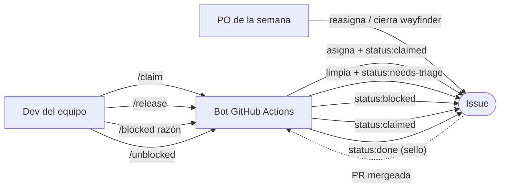
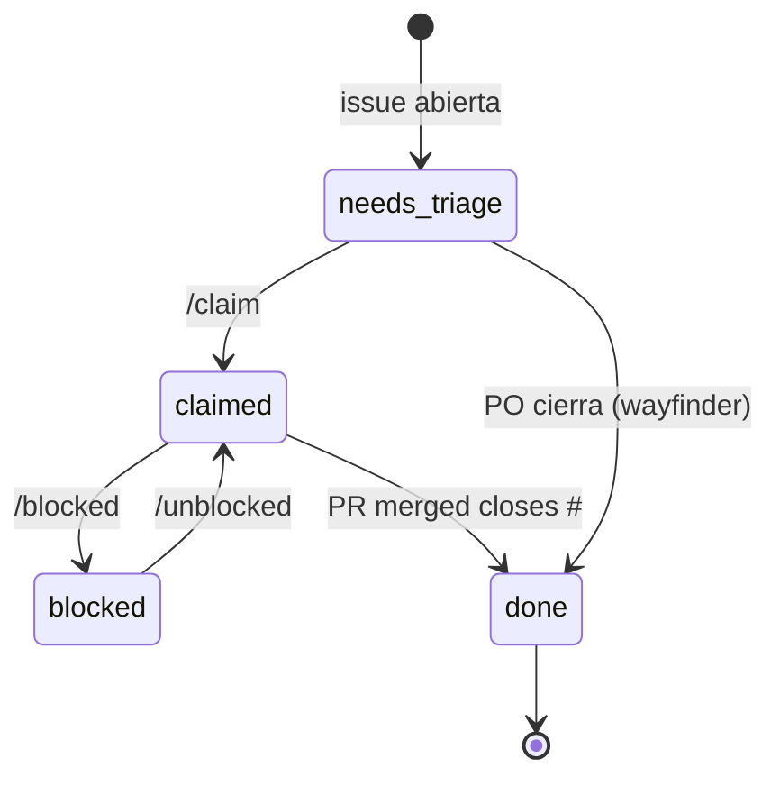

# 🚀 QUICKSTART — Alethea triage workflow

> Esta guía es para **dos audiencias**:
> 1. **Devs nuevos en el equipo** que necesitan entender cómo trabajar con issues.
> 2. **Evaluadores de la materia "Proyecto"** que necesitan auditar quién hizo qué.
>
> Leé primero §1 (overview), después salta a tu audiencia.

---

## Índice

1. [El modelo en 1 pantalla](#1-el-modelo-en-1-pantalla)
2. [Para devs: 3 escenarios paso-a-paso](#2-para-devs-3-escenarios-paso-a-paso)
   - 2.1 [Tomar y terminar una issue](#21-tomar-y-terminar-una-issue)
   - 2.2 [Una semana como PO](#22-una-semana-como-po)
   - 2.3 [Issue bloqueada](#23-issue-bloqueada)
3. [Para evaluadores: auditoría rápida](#3-para-evaluadores-auditoria-rapida)
4. [Anti-patrones: lo que NO hacemos](#4-anti-patrones-lo-que-no-hacemos)
5. [Ver también](#5-ver-tambien)

---

## 1. El modelo en 1 pantalla



| Comando | Quién | Efecto |
|---|---|---|
| `/claim` | Cualquier MEMBER/OWNER | Toma la issue (lock activo) |
| `/release` | Solo el assignee actual | Libera la issue (vuelve al pool) |
| `/blocked <razón>` | Solo el assignee actual | Marca como bloqueada con razón |
| `/unblocked` | Solo el assignee actual | Desbloquea |
| (PR a `.github/ROTA.yml`) | Cuando el equipo decide | Cambia el PO activo |

**Mapeo de nombres ficticios a reales** (usado en los ejemplos de abajo):

| Ficticio | Real |
|---|---|
| Alicia | @vicenzogiordana (PO semana 1) |
| Bruno | @huajar |
| Carla | @teofurlan |
| Diego | @eveernst |
| Elena | @demianfrick |

---

## 2. Para devs: 3 escenarios paso-a-paso

### 2.1 Tomar y terminar una issue

**Contexto**: Bruno (@huajar) ve una issue nueva en el tablero. La lee, le interesa, y decide tomarla.

#### Pasos narrativos

1. **Bruno abre el tablero de issues** y busca una con label `status:needs-triage` y `area:encryption` (su área). Encuentra **#121 "Refactor del crisis monitor para soportar múltiples canales"** que coincide.

2. **Lee la issue** (acepta los criterios). Se siente cómodo para resolverla en 2-3 días.

3. **Comenta `/claim`** en la issue.

4. **El bot responde** con un comentario: *"✅ Issue tomada por @huajar. Lock activo — nadie más puede desasignarte."*. La issue ahora tiene label `status:claimed` y Bruno es el único assignee.

5. **Bruno abre una rama**: `git switch -c fix/121-crisis-monitor-refactor`.

6. **Desarrolla siguiendo TDD** (rojo → verde → refactor). Cuando termina, hace commit y push.

7. **Abre la PR** usando la plantilla `PULL_REQUEST_TEMPLATE.md`. Completa el checklist:
   - [x] `mix precommit` corre limpio
   - [x] Tests nuevos
   - [x] Si toca RAG: ingestion rules respetadas
   - El body dice: `Closes #121`

8. **Marca la PR como Ready for Review** (saca el draft).

9. **El bot comenta en la PR**: *"ℹ️ Esta PR cierra #121 (asignada a @huajar) pero el autor es @huajar. ¿Es intencional?"* — espera, no, en este caso el bot NO comenta porque el PR author == assignee. Todo consistente.

10. **Alicia (PO de la semana) aprueba la PR** y la mergea.

11. **El bot ahora** cambia la label de `status:claimed` a `status:done` y comenta en #121: *"✅ Issue cerrada vía PR #128. status:claimed → status:done (sello histórico, no se quita)."*

12. **Bruno puede cerrar la issue manualmente** o el equipo la cierra al mergear (GitHub a veces lo hace solo si el PR body dice `Closes #N`).

#### Comandos `gh` correspondientes

```bash
# Paso 3: /claim
gh issue comment 121 --body "/claim"

# Paso 5: crear rama
git switch -c fix/121-crisis-monitor-refactor

# Paso 7: abrir PR (cuando esté lista)
gh pr create --draft \
  --title "fix: crisis monitor supports multiple channels" \
  --body "$(cat <<'EOF'
## Qué cambia
Refactor del crisis monitor para soportar múltiples canales.

## Issue
Closes #121

## Checklist
- [x] `mix precommit` corre limpio
- [x] Tests nuevos
- [x] RAG ingestion rules respetadas

## Notas para el reviewer
Mantuve compatibilidad con el worker existente.
EOF
)"

# Paso 8: marcar como ready
gh pr ready 128

# Verificación post-merge
gh issue view 121 --json labels,assignees,state
# Esperado: state="closed", labels incluye "status:done", assignees=[huajar]
```

---

### 2.2 Una semana como PO

**Contexto**: Alicia (@vicenzogiordana) es la PO de la semana 1. Le toca revisar las decisiones de producto, destrabar, y manejar las issues `wayfinder:*`.

#### Escenario A: Responder a issue con `triage:rotating`

1. **Diego (@eveernst) abre la issue #145** "Decidir si las notas clínicas se ingieren al RAG". Diego le pone label `triage:rotating` porque necesita decisión de producto.

2. **El bot notifica** a Alicia vía la issue #0 (Triage rota) que hay issues con `triage:rotating`.

3. **Alicia lee la issue #145**, investiga el impacto clínico, y decide: "Sí, las notas se ingieren, pero solo el texto libre, NO los adjuntos".

4. **Alicia comenta en #145** la decisión con justificación clínica. Reasigna la issue a Diego para que implemente.

5. **Como Alicia es PO**, el hard lock la deja reasignar sin problema. Diego queda como nuevo assignee.

6. **Diego ahora ve la issue como `claimed`** y arranca el trabajo.

```bash
# Paso 3: Alicia lee el contexto
gh issue view 145 --json body,comments

# Paso 5: Alicia reasigna (PO bypass)
gh issue edit 145 --add-assignee eveernst --remove-assignee vicenzogiordana
# El bot va a comentar "🔧 PO de la semana (@vicenzogiordana) reasignó esta issue."
```

#### Escenario B: Manejar una `wayfinder:prototype`

1. **El equipo decide prototipar** la nueva vista de crisis. Bruno abre la issue #150 "Prototipo: vista de crisis en tiempo real" con label `wayfinder:prototype`.

2. **Bruno NO puede `/claim`** porque el bot detecta el label wayfinder:prototype y rechaza con: *"🚫 Esta issue tiene label wayfinder:prototype — son artefactos HITL. Solo el PO de la semana la puede manejar."*

3. **Alicia (PO) maneja la issue directamente**:
   - Lee el prototipo cuando Bruno lo entrega.
   - Decide: "Lo prototipo se ve bien, abrir issue de implementación como `type:feature` y cerrar esta".
   - Cierra #150 con un comment "Prototipo aprobado, implementación tracked en #152".

```bash
# Paso 3: Alicia cierra la wayfinder
gh issue close 150 --comment "Prototipo aprobado. Implementación en #152."
```

#### Escenario C: Decisión de prioridad

1. **Carla (@teofurlan) abre #160** "Agregar export CSV de pacientes". Le pone `priority:p2` (backlog).

2. **El PO (Alicia) decide** que esto bloquea la entrega de fin de mes y lo sube a `priority:p1`.

```bash
gh issue edit 160 --remove-label "priority:p2" --add-label "priority:p1"
# (Sin reasignación, solo label change. Alicia puede hacerlo porque es owner.)
```

---

### 2.3 Issue bloqueada

**Contexto**: Bruno tomó #130 "Integrar Pepper rotation con Vault" hace 3 días. Se topó con que la decisión sobre si el Pepper vive en el Vault o en una env var todavía no está tomada (es una decisión de seguridad pendiente).

#### Diagrama de estados



#### Pasos narrativos

1. **Bruno comenta** `/blocked esperando decisión sobre dónde vive el Pepper (Vault vs env var)` en #130.

2. **El bot agrega** label `status:blocked` y comenta: *"🛑 Bloqueada por @huajar: esperando decisión sobre dónde vive el Pepper (Vault vs env var). Para desbloquear: /unblocked."*

3. **Bruno avisa por chat** al equipo que la issue está bloqueada. La presión social hace que Diego (que tiene expertise en encryption) responda al chat y proponga: "Vault, con pepper per-tenant como dice ADR-008".

4. **Alicia (PO) toma la decisión** y crea la ADR-010 "Pepper per-tenant en Vault" como seguimiento.

5. **Bruno lee la decisión, está de acuerdo**, y comenta `/unblocked` en #130.

6. **El bot remueve** `status:blocked`, agrega `status:claimed`, y comenta: *"🔄 @huajar desbloqueó esta issue. Vuelve a status:claimed."*

7. **Bruno sigue con el trabajo** y eventualmente abre la PR que cierra #130.

#### Comandos `gh` correspondientes

```bash
# Paso 1: bloquear
gh issue comment 130 --body "/blocked esperando decisión sobre dónde vive el Pepper (Vault vs env var)"

# Verificar estado
gh issue view 130 --json labels
# Esperado: labels incluye ["status:blocked"]

# Paso 5: desbloquear
gh issue comment 130 --body "/unblocked"

# Verificar
gh issue view 130 --json labels
# Esperado: labels incluye ["status:claimed"], NO incluye "status:blocked"
```

---

## 3. Para evaluadores: auditoría rápida

Esta sección te dice cómo responder las preguntas típicas de la defensa de "Proyecto" usando `gh`.

### Preguntas frecuentes

| # | Pregunta | Comando | Output esperado |
|---|---|---|---|
| 1 | ¿Quién fue PO la semana N? | `gh issue view 150 --json body` | Tabla en el body con semana → handle |
| 2 | ¿Qué issues están tomadas ahora? | `gh issue list --label status:claimed --json number,title,assignees` | Lista de issues con assignee |
| 3 | ¿Qué issues están bloqueadas? | `gh issue list --label status:blocked` | Lista de issues bloqueadas |
| 4 | ¿Quién trabajó más issues? | `gh issue list --state closed --json assignees --limit 200 \| jq '[.[] \| .assignees[0].login] \| group_by(.) \| map({user: .[0], count: length}) \| sort_by(.count) \| reverse'` | Tabla con count por dev |
| 5 | ¿Qué PRs mergeadas cerraron issues? | `gh pr list --state merged --search "Closes" --json number,title,closingIssuesReferences` | Lista con issues cerradas |
| 6 | ¿Hay issues sin asignar hace mucho? | `gh issue list --label status:needs-triage --json number,title,createdAt --limit 20` | Lista ordenada por fecha |
| 7 | ¿El PO de la semana actual está activo? | `gh issue view 150 --json body \| jq -r '.body \| capture("current_po.*?@(\\w+)")'` | Handle del PO |

### Diagrama de actores + responsabilidad

```mermaid
flowchart TB
    subgraph Equipo["Equipo (5 personas)"]
        A[Alicia<br/>PO semana 1<br/>@vicenzogiordana]
        B[Bruno<br/>Dev<br/>@huajar]
        C[Carla<br/>Dev<br/>@teofurlan]
        D[Diego<br/>Dev<br/>@eveernst]
        E[Elena<br/>Dev<br/>@demianfrick]
    end

    subgraph Bot["Bot GitHub Actions"]
        T[triage.yml]
    end

    subgraph Estado["Estado issues"]
        N[status:needs-triage]
        C2[status:claimed]
        B2[status:blocked]
        D2[status:done]
    end

    A -->|reasigna / cierra wayfinder| Estado
    B -->|/claim /release /blocked| T
    C -->|/claim /release /blocked| T
    D -->|/claim /release /blocked| T
    E -->|/claim /release /blocked| T
    T --> Estado
```

### Cómo auditar la rotación

```bash
# Ver la tabla de rotación completa
gh issue view 150 --json body --jq '.body'

# Ver solo el PO actual
gh issue view 150 --json body --jq '.body' | grep -A 2 "## PO actual"

# Ver el orden de rotación (archivo)
gh api repos/alethea-org/Alethea/contents/.github/ROTA.yml --jq '.content' | base64 -d
```

---

## 4. Anti-patrones: lo que NO hacemos

1. **No `/claim` una issue que no podés empezar hoy.** Bloqueás el camino de otro. Si tenés que tomarla pero no podés empezar ahora, dejá que otro la tome; cuando se libere, `/claim` vos.

2. **No reasignes manualmente una issue asignada a otro.** Si la querés, pedile al assignee que haga `/release`. El hard lock existe para proteger el contexto del que arrancó.

3. **No cierres `wayfinder:prototype` o `wayfinder:grilling` sin consenso del PO de la semana.** Son artefactos HITL. El PO las maneja, no un dev.

4. **Editá `.github/ROTA.yml` con un PR cuando cambie el PO activo.** Es la única manera de cambiar quién es el PO; los pushes directos a `main` están bloqueados por branch protection.

5. **No uses el PO como excusa para no tomar issues.** El PO coordina y destraba, pero también puede `claim` y trabajar como cualquier dev. Si el PO está overloaded, el equipo habla, no espera.

---

## 5. Ver también

- **[`.github/CONTRIBUTING.md`](./CONTRIBUTING.md)** — reglas formales, vocabulario completo de labels, decisiones de diseño.
- **[`.github/PULL_REQUEST_TEMPLATE.md`](./PULL_REQUEST_TEMPLATE.md)** — checklist que vas a usar cuando abras una PR.
- **[`.github/ROTA.yml`](./ROTA.yml)** — el orden de rotación (editable con un PR).
- **[Issue #150 Triage rota](https://github.com/alethea-org/Alethea/issues/150)** — la fuente de verdad visible del PO actual.
- **[`openspec/adr/009-triage-workflow.md`](../../openspec/adr/009-triage-workflow.md)** — el ADR con la decisión, alternativas y consecuencias.
- **[`openspec/sdd/triage-workflow/`](../../openspec/sdd/triage-workflow/)** — el SDD completo (proposal, exploration, spec, design, tasks).

---

> **TL;DR**: Si entendés el modelo, todo lo demás es obvious. Si no, releé §1 hasta que el diagrama Mermaid te cierre. Después seguí con tu escenario.
